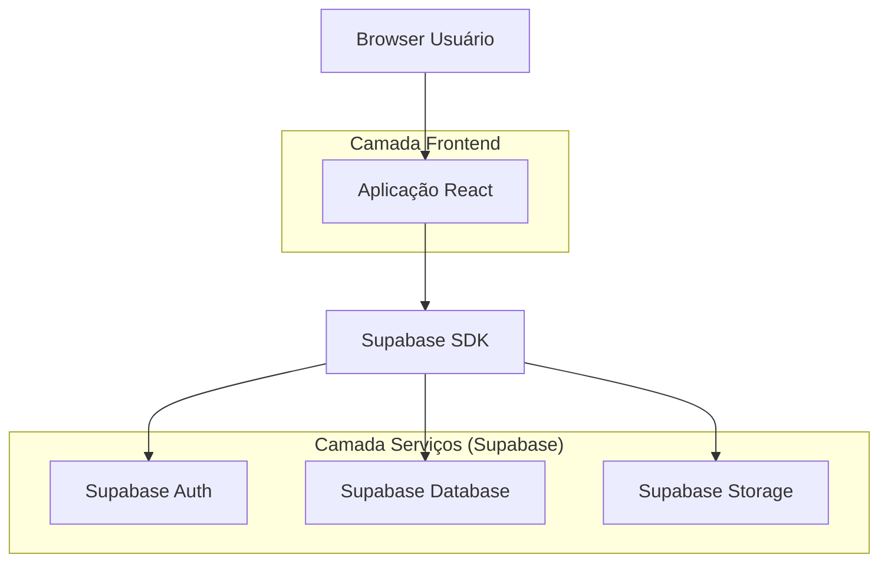
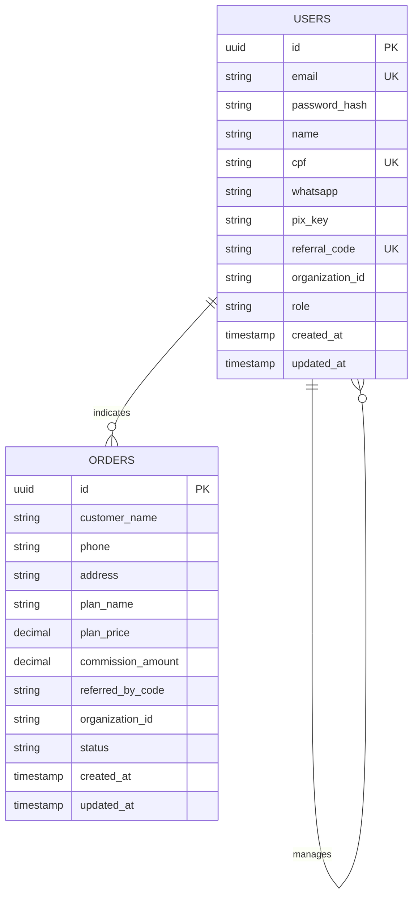

## 1. Arquitetura do Sistema



## 2. Tecnologias Utilizadas

* **Frontend**: React\@18 + tailwindcss\@3 + vite

* **Ferramenta de Inicialização**: vite-init

* **Backend**: Supabase (BaaS)

* **Banco de Dados**: PostgreSQL (via Supabase)

* **Autenticação**: Supabase Auth

## 3. Definições de Rotas

| Rota       | Finalidade                                                 |
| ---------- | ---------------------------------------------------------- |
| /          | Página inicial ou redirecionamento para cadastro           |
| /cadastro  | Página de cadastro de novos afiliados                      |
| /login     | Página de autenticação para afiliados                      |
| /dashboard | Dashboard do afiliado com métricas e link de indicação     |
| /assinar   | Página pública para clientes finais solicitarem assinatura |

## 4. Definições de API

### 4.1 APIs do Supabase

**Autenticação de Afiliado**

```javascript
// Login
const { data, error } = await supabase.auth.signInWithPassword({
  email: email,
  password: password
})

// Cadastro
const { data, error } = await supabase.auth.signUp({
  email: email,
  password: password,
  options: {
    data: {
      name: name,
      cpf: cpf,
      whatsapp: whatsapp,
      pix_key: pix_key,
      referral_code: referral_code,
      organization_id: 'fs-net-org-id'
    }
  }
})
```

**Cadastro de Pedido**

```javascript
const { data, error } = await supabase
  .from('orders')
  .insert([
    {
      customer_name: customer_name,
      phone: phone,
      address: address,
      plan_name: plan_name,
      plan_price: plan_price,
      commission_amount: commission_amount,
      referred_by_code: referred_by_code,
      organization_id: 'fs-net-org-id',
      status: 'pending'
    }
  ])
```

**Consultar Métricas do Afiliado**

```javascript
// Total de indicações
const { count } = await supabase
  .from('orders')
  .select('*', { count: 'exact', head: true })
  .eq('referred_by_code', referral_code)
  .eq('organization_id', 'fs-net-org-id')

// Comissões pendentes
const { data } = await supabase
  .from('orders')
  .select('commission_amount')
  .eq('referred_by_code', referral_code)
  .eq('organization_id', 'fs-net-org-id')
  .eq('status', 'pending')
```

## 5. Modelo de Dados

### 5.1 Definição do Modelo



### 5.2 Linguagem de Definição de Dados (DDL)

**Tabela de Usuários (users)**

```sql
-- Criar extensão para UUID
CREATE EXTENSION IF NOT EXISTS "uuid-ossp";

-- Criar tabela de usuários (usa a tabela auth.users do Supabase)
-- Os dados adicionais ficam em auth.users.raw_user_meta_data

-- Adicionar colunas customizadas via trigger
CREATE OR REPLACE FUNCTION handle_new_user()
RETURNS TRIGGER AS $$
BEGIN
    -- Garantir que organization_id seja sempre fs-net
    IF NEW.raw_user_meta_data->>'organization_id' IS NULL THEN
        NEW.raw_user_meta_data = jsonb_set(NEW.raw_user_meta_data, '{organization_id}', '"fs-net-org-id"');
    END IF;
    
    -- Gerar referral_code se não existir
    IF NEW.raw_user_meta_data->>'referral_code' IS NULL THEN
        NEW.raw_user_meta_data = jsonb_set(
            NEW.raw_user_meta_data, 
            '{referral_code}', 
            to_jsonb(substring(NEW.raw_user_meta_data->>'name' from 1 for 4) || floor(random() * 100)::text)
        );
    END IF;
    
    RETURN NEW;
END;
$$ LANGUAGE plpgsql SECURITY DEFINER;

CREATE TRIGGER on_auth_user_created
    BEFORE INSERT ON auth.users
    FOR EACH ROW EXECUTE FUNCTION handle_new_user();
```

**Tabela de Pedidos (orders)**

```sql
-- Criar tabela de pedidos
CREATE TABLE orders (
    id UUID PRIMARY KEY DEFAULT uuid_generate_v4(),
    customer_name VARCHAR(255) NOT NULL,
    phone VARCHAR(20) NOT NULL,
    address TEXT NOT NULL,
    plan_name VARCHAR(50) NOT NULL,
    plan_price DECIMAL(10,2) NOT NULL,
    commission_amount DECIMAL(10,2) NOT NULL,
    referred_by_code VARCHAR(50),
    organization_id VARCHAR(100) NOT NULL,
    status VARCHAR(20) DEFAULT 'pending' CHECK (status IN ('pending', 'approved', 'rejected', 'installed')),
    created_at TIMESTAMP WITH TIME ZONE DEFAULT NOW(),
    updated_at TIMESTAMP WITH TIME ZONE DEFAULT NOW()
);

-- Criar índices
CREATE INDEX idx_orders_referred_by_code ON orders(referred_by_code);
CREATE INDEX idx_orders_organization_id ON orders(organization_id);
CREATE INDEX idx_orders_status ON orders(status);
CREATE INDEX idx_orders_created_at ON orders(created_at DESC);

-- Configurar Row Level Security (RLS)
ALTER TABLE orders ENABLE ROW LEVEL SECURITY;

-- Políticas de acesso
CREATE POLICY "Anônimos podem criar pedidos" ON orders
    FOR INSERT TO anon
    WITH CHECK (true);

CREATE POLICY "Usuários autenticados podem ver próprias indicações" ON orders
    FOR SELECT TO authenticated
    USING (referred_by_code = auth.jwt() ->> 'raw_user_meta_data' ->> 'referral_code');

CREATE POLICY "Admin pode ver tudo da organização" ON orders
    FOR ALL TO authenticated
    USING (organization_id = 'fs-net-org-id' AND auth.jwt() ->> 'raw_user_meta_data' ->> 'role' = 'admin');

-- Grant permissions
GRANT SELECT ON orders TO anon;
GRANT INSERT ON orders TO anon;
GRANT SELECT ON orders TO authenticated;
```

### 5.3 Dados Iniciais

```sql
-- Inserir planos de preços (se necessário armazenar)
-- As comissões são calculadas na aplicação baseado no plano escolhido

-- Configurar organização FS NET (via metadata nos usuários)
-- Todos os usuários terão organization_id = 'fs-net-org-id'
```

## 6. Regras de Multi-Tenancy

### 6.1 Implementação via Organization ID

* Todos os registros devem conter `organization_id = 'fs-net-org-id'`

* Queries devem sempre filtrar por organization\_id

* Usar `orgInsert()` e `orgSelect()` nas operações do Supabase

### 6.2 Exemplo de Implementação

```javascript
// Função helper para operações multi-tenant
const orgInsert = async (table, data) => {
  return await supabase
    .from(table)
    .insert([{ ...data, organization_id: 'fs-net-org-id' }])
}

const orgSelect = async (table, filters = {}) => {
  return await supabase
    .from(table)
    .select('*')
    .eq('organization_id', 'fs-net-org-id')
    .match(filters)
}
```

## 7. Cálculo de Comissões

### 7.1 Tabela de Comissões Fixas

```javascript
const COMMISSIONS = {
  '300MB': 20.00,
  '500MB': 50.00,
  '800MB': 100.00
}

const getCommissionAmount = (planName) => {
  return COMMISSIONS[planName] || 0
}
```

