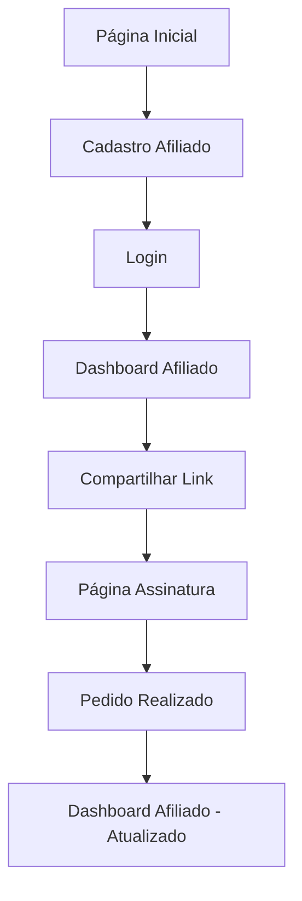

## 1. Visão Geral do Produto

Sistema de indicações para provedor de internet FS NET. Afiliados cadastram-se e recebem códigos únicos para divulgação. Clientes acessam link de indicação, escolhem planos e realizam pedidos. Sistema calcula comissões fixas por indicação.

**Valor de Mercado:** Sistema de vendas por indicação para provedores de internet, automatizando comissões e rastreamento de indicações.

## 2. Funcionalidades Principais

### 2.1 Papéis de Usuário

| Papel         | Método de Cadastro                         | Permissões Principais                                                              |
| ------------- | ------------------------------------------ | ---------------------------------------------------------------------------------- |
| Afiliado      | Cadastro via formulário com dados pessoais | Acessar dashboard, visualizar link de indicação, acompanhar comissões e indicações |
| Cliente Final | Cadastro via página pública de assinatura  | Solicitar instalação de planos de internet                                         |
| Administrador | Cadastro interno                           | Gerenciar afiliados, pedidos e comissões                                           |

### 2.2 Módulos de Funcionalidades

Sistema FS NET consiste nas seguintes páginas principais:

1. **Cadastro de Afiliado**: Formulário com dados pessoais e geração automática de código de indicação.
2. **Dashboard do Afiliado**: Área logada com link de divulgação, métricas de indicações e lista de clientes indicados.
3. **Página de Assinatura Pública**: Formulário para clientes finais escolherem planos e informar código de indicação.
4. **Login**: Página de autenticação para afiliados.

### 2.3 Detalhes das Páginas

| Nome da Página       | Módulo                 | Descrição das Funcionalidades                                                                                                                                          |
| -------------------- | ---------------------- | ---------------------------------------------------------------------------------------------------------------------------------------------------------------------- |
| Cadastro Afiliado    | Formulário de Cadastro | Coletar nome, CPF, WhatsApp, email, senha e chave Pix. Gerar código de indicação automático baseado no nome + número aleatório. Salvar com organization\_id da FS NET. |
| Dashboard Afiliado   | Link de Divulgação     | Exibir código do afiliado e link completo pronto para copiar/compartilhar no WhatsApp.                                                                                 |
| Dashboard Afiliado   | Cards de Métricas      | Mostrar total de indicações realizadas e comissões pendentes baseadas nas vendas vinculadas ao código do afiliado.                                                     |
| Dashboard Afiliado   | Tabela de Indicações   | Listar clientes indicados com nome, plano escolhido, valor da comissão e status do pedido.                                                                             |
| Página de Assinatura | Formulário Cliente     | Coletar nome, WhatsApp e endereço do cliente final.                                                                                                                    |
| Página de Assinatura | Seleção de Plano       | Exibir 3 cards clicáveis com planos 300MB (R$80), 500MB (R$100) e 800MB (R$130) com preços mensais.                                                                    |
| Página de Assinatura | Código de Indicação    | Campo para código do afiliado. Se URL tiver parâmetro ?ref=XXX, preencher automaticamente e travar. Se não, permitir digitação.                                        |
| Página de Assinatura | Solicitar Instalação   | Salvar pedido com status 'pending', calcular comissão (R$20, R$50 ou R$100) baseado no plano, vincular ao código do afiliado. Mostrar mensagem de sucesso.             |

## 3. Fluxo Principal

### Fluxo do Afiliado

1. Acessa página de cadastro e preenche dados pessoais
2. Sistema gera código único de indicação
3. Acessa dashboard para copiar link de divulgação
4. Compartilha link com potenciais clientes
5. Acompanha indicações e comissões no dashboard

### Fluxo do Cliente Final

1. Recebe link de indicação ou código verbal
2. Acessa página pública de assinatura
3. Preenche dados pessoais e seleciona plano
4. Informa código de indicação (se aplicável)
5. Solicita instalação e recebe confirmação

## 4. Interface do Usuário

### 4.1 Estilo de Design

* **Cores Primárias**: Azul FS NET (#1E40AF) e branco

* **Cores Secundárias**: Verde para sucesso (#10B981), vermelho para alertas (#EF4444)

* **Estilo de Botões**: Arredondados com sombra sutil, hover com transição suave

* **Fonte**: Inter ou Roboto, tamanhos 14-16px para texto, 18-24px para títulos

* **Layout**: Baseado em cards com bordas arredondadas e espaçamento generoso

* **Ícones**: Feather Icons ou Heroicons em estilo outline

### 4.2 Visão Geral das Páginas

| Nome da Página     | Módulo          | Elementos de UI                                                                                      |
| ------------------ | --------------- | ---------------------------------------------------------------------------------------------------- |
| Cadastro Afiliado  | Formulário      | Campos de entrada com labels flutuantes, validação em tempo real, botão principal destacado em azul. |
| Dashboard Afiliado | Link Divulgação | Card destacado com código em fonte monoespaçada, botão de copiar com ícone de cópia.                 |
| Dashboard Afiliado | Métricas        | Cards coloridos com números grandes e ícones relevantes, layout em grid responsivo.                  |
| Dashboard Afiliado | Tabela          | Tabela limpa com zebrado, status coloridos, ordenação por data.                                      |
| Página Assinatura  | Cards Planos    | Cards horizontais com destaque visual para o plano selecionado, badge de preço destacado.            |
| Página Assinatura  | Formulário      | Layout vertical com passos visuais, progress bar para indicar etapa atual.                           |

### 4.3 Responsividade

* **Desktop-first**: Otimizado para telas grandes com layout de dashboard

* **Mobile-adaptativo**: Layout empilhado em telas pequenas, menu hambúrguer para navegação

* **Touch optimization**: Botões com área de toque mínima de 44x44px, formulários com teclado adaptativo

